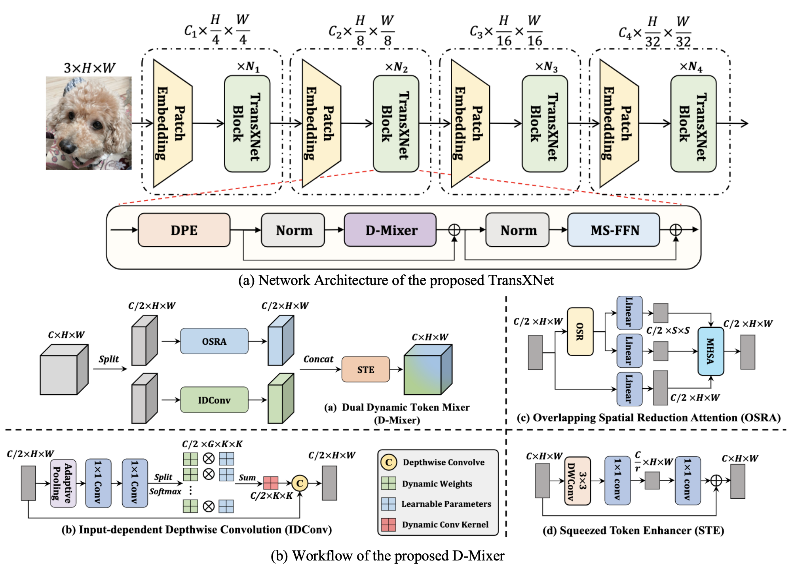

# TransXNet: Learning Both Global and Local Dynamics with a Dual Dynamic Token Mixer for Visual Recognition

This is an official PyTorch implementation of "[TransXNet: Learning Both Global and Local Dynamics with a Dual Dynamic Token Mixer for Visual Recognition](https://arxiv.org/abs/2310.19380)".

# Introduction
```TransXNet``` is a CNN-Transformer hybrid vision backbone that can model both global and local dynamics with a Dual Dynamic Token Mixer (D-Mixer), achieving superior performance over both CNN and Transformer-based models.
<center> 

</center>

# Image Classification

## 1. Requirements
We highly suggest using our provided dependencies to ensure reproducibility:
```
# Environments:
cuda==11.6
python==3.8.15
# Packages:
mmcv==1.7.1
timm==0.6.12
torch==1.13.1
torchvision==0.14.1
```
## 2. Data Preparation
[ImageNet](https://image-net.org/) with the following folder structure, you can extract ImageNet by this [script](https://gist.github.com/BIGBALLON/8a71d225eff18d88e469e6ea9b39cef4).

```
│imagenet/
├──train/
│  ├── n01440764
│  │   ├── n01440764_10026.JPEG
│  │   ├── n01440764_10027.JPEG
│  │   ├── ......
│  ├── ......
├──val/
│  ├── n01440764
│  │   ├── ILSVRC2012_val_00000293.JPEG
│  │   ├── ILSVRC2012_val_00002138.JPEG
│  │   ├── ......
│  ├── ......
```

## 3. Main Results on ImageNet with Pretrained Models

| Models      | Input Size | FLOPs (G) | Params (M) | Top-1 Acc.(%) | Download |
|:-----------:|:----------:|:---------:|:----------:|:----------:|:----------:|
| TransXNet-T | 224x224    | 1.8       | 12.8       | 81.6       | [model](https://github.com/LMMMEng/TransXNet/releases/download/v1.0/transx-t.pth.tar)     |
| TransXNet-S | 224x224    | 4.5       | 26.9       | 83.8       | [model](https://github.com/LMMMEng/TransXNet/releases/download/v1.0/transx-s.pth.tar)     |
| TransXNet-B | 224x224    | 8.3       | 48.0       | 84.6       | [model](https://github.com/LMMMEng/TransXNet/releases/download/v1.0/transx-b.pth.tar)     |

## 4. Train
To train ```TransXNet``` models on ImageNet-1K with 8 gpus (single node), run:
```
bash scripts/train_tiny.sh # train TransXNet-T
bash scripts/train_small.sh # train TransXNet-S
bash scripts/train_base.sh # train TransXNet-B
```

## 5. Validation
To evaluate ```TransXNet``` on ImageNet-1K, run:
```
MODEL=transxnet_t # transxnet_{t, s, b}
python3 validate.py \
/path/to/imagenet \
--model $MODEL -b 128 \
--pretrained # or --checkpoint /path/to/checkpoint 
```

# Object Detection and Semantic Segmentation
> [Object Detection](object_detection)    
> [Semantic Segmentation](semantic_segmentation)

# Citation
If you find this project useful for your research, please consider citing:
```
@article{lou2023transxnet,
  title={TransXNet: Learning Both Global and Local Dynamics with a Dual Dynamic Token Mixer for Visual Recognition},
  author={Lou, Meng and Zhou, Hong-Yu and Yang, Sibei and Yu, Yizhou},
  journal={arXiv preprint arXiv:2310.19380},
  year={2023}
}
```

# Acknowledgment
Our implementation is mainly based on the following codebases. We gratefully thank the authors for their wonderful works.
> [poolformer](https://github.com/sail-sg/poolformer)  
> [pytorch-image-models](https://github.com/rwightman/pytorch-image-models)    
> [mmdetection](https://github.com/open-mmlab/mmdetection)     
> [mmsegmentation](https://github.com/open-mmlab/mmsegmentation)

# Contact
If you have any questions, please feel free to [create issues](https://github.com/LMMMEng/TransXNet/issues) or contact me at lmzmm.0921@gmail.com.